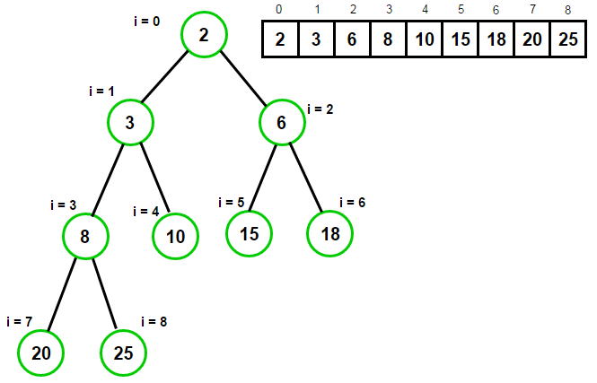

# Project 8: Priority Heaps

**Due Thursday, April 7th @ 10:00 PM ET**

*This is not a team project, do not copy someone else's work.*

*Make sure to read the entire project description, especially the grading policies.*

## Assignment Overview



In this project, you will be implementing a max heap and a min heap. Heaps are 
data structures that are complete trees, with the parent of each node being smaller than its children in a min heap, 
and larger than its children in a max heap. A min heap always has the element with the smallest value as its root, 
while a max heap always has the element with the largest value as its root.
For more information on Heaps, go to [D2L-Week-9](https://d2l.msu.edu/d2l/le/content/1676253/Home), check out the Heap Content.

Heaps are often used in creating a priority queue implementation, although we will not do that here. Many algorithms
and problems that need to be able to find minimums and maximums will use a heap to take advantage of the O(1) lookup
it can provide.

## Assignment Notes

* REMEMBER TO FILL OUT YOUR DOCSTRINGS!
* heapq and any other priority queue/heap modules are not permitted on this project, it will result with a 0 of this project.
* Values will all be integers
* Some heaps start at an index at one. However, for this assignment, **indexing will start at index zero**, just like normal lists.
* Keep in mind that .pop(0) is O(n), and using it will likely cause you to break time complexity!
* Consider using the pythonic swap! The syntax for this is `a, b = b, a`. it is the same as writing something like `temp = a; a = b; b = temp` but removes the extra variables and works a bit cleaner!
* **HINT:** The MaxHeap class uses a MinHeap to handle all of its operations. Think about how you can do a math trick to make this work
  * Is 2 greater than or less than 4? Is -2 greater than or less than -4?

## Assignment Specifications

You will be given one file to edit, `solution.py`. You must complete and implement the following functions. Take note of
the specified return values and input parameters. 

### **class MinHeap:**

_**Do not modify** the following attributes/methods_

*   **Attributes:**
    *   **data:** This is a list that stores all the elements in our heap
*   **init(self) -> None:**
    *   This function initializes a MinHeap
*   **str(self) -> str:**
    *   A string representation of the list.
*   **repr(self) -> str:**
    *   A string representation of the list.
*   **to_tree_format_string(self) -> str:**
    *   This makes a heap in breadth first formatting, for use in debugging

Implement the following functions. Take note of the specified return values, input parameters, and time complexity requirements. **Do not change the function signatures, including default values.**

*   **\_\_len\_\_(self) -> int:**
    *   Returns the length of the heap
    *   Time complexity: _O(1)_
    *   Space Complexity: _O(1)_
*   **empty(self) -> bool:**
    *   Checks if the heap is empty
    *   Return a boolean stating if the heap is empty or not
    *   Time complexity: _O(1)_
    *   Space Complexity: _O(1)_
*   **top(self) -> int:**
    *   Returns the top value of the MinHeap
        * This will be the minimum value, as this is a MinHeap!
    *   Time complexity: _O(1)_
    *   Space Complexity: _O(1)_
*   **get_left_child_index(self, index: int) -> int:**
    *   Computes the index of the left child at the parent index **index**
    *   Returns an int with the left child's index (or None if no such child exists)
    *   Time complexity: _O(1)_
    *   Space Complexity: _O(1)_
*   **get_right_child_index(self, index: int) -> int:**
    *   Computes the index of the right child at the parent index **index**
    *   Returns an int with the right child's index (or None if no such child exists)
    *   Time complexity: _O(1)_
    *   Space Complexity: _O(1)_
*   **get_parent_index(self, index: int) -> int:**
    *   Computes the index of the parent at the child index **index**
    *   Returns an int with the parents's index (or None if no such parent exists)
    *   Time complexity: _O(1)_
    *   Space Complexity: _O(1)_
*   **get_min_child_index(self, index: int) -> int:**
    *   Computes the index of the child with the lower value at the parent **index**
        * This function should take advantage of two of the other functions you have written!
    *   If both children have the same value, return the right child's index
    *   If the node has no children, return None 
    *   Returns an int with the minimum value child's index (or None if no children)
    *   Time complexity: _O(1)_
    *   Space Complexity: _O(1)_
*   **percolate_up(self, index: int) -> None:**
    *   Percolates up the value at index **index** to its valid spot in the heap
        * That is, percolate the value up until the node's value is greater than that of its parent
    *   When comparing equal nodes, treat the parent as if it is smaller than the child
    *   Returns None
    *   Time complexity: _O(log(n))_
    *   Space Complexity: _O(1)_
*   **percolate_down(self, index: int) -> None:**
    *   Percolates down the value at index **index** to its valid spot in the heap
        * That is, percolate the value down until both of it's children's are less than the value that started at position index
    *   When comparing equal nodes, treat the parent as if it is smaller than the child
    *   Returns None
    *   Time complexity: _O(log(n))_
    *   Space Complexity: _O(1)_
*   **push(self, val: int) -> None:**
    *   Pushes the **value** to our heap and gets it to the proper position
        * This should be a pretty short function - most of the work will happen in percolate_up!
    *   Returns None
    *   Time complexity: _O(log(n))_
    *   Space Complexity: _O(1)_
*   **pop(self) -> int:**
    *   Removes the top element from the heap
        * This will be the minimum value!
    *   Restores the heap to be valid after the top element is removed 
    *   Returns the value that was popped
    *   Time complexity: _O(log(n))_
    *   Space Complexity: _O(1)_

### **class MaxHeap:**

_**Do not modify** the following attributes/methods_

*   **Attributes:**
    *   **MinHeap:** This MinHeap does most of the work for us in MaxHeap
*   **init(self) -> None:**
    *   This function initializes a MinHeap
*   **str(self) -> str:**
    *   A string representation of the list.
*   **repr(self) -> str:**
    *   A string representation of the list.
*   **len(self) -> int:**
    *   Length of the MaxHeap
*   **print_tree_format(self) -> str:**
    *   This prints the heap in breadth first formatting, for use in debugging

Implement the following functions. Take note of the specified return values, input parameters, and time complexity requirements. **Do not change the function signatures, including default values.**

*   **empty(self) -> bool:**
    *   Checks if the heap is empty
    *   Return a boolean stating if the heap is empty or not
    *   Time complexity: _O(1)_
    *   Space Complexity: _O(1)_
*   **top(self) -> int:**
    *   Returns the top value of the MaxHeap
        * This will be the maximum value, as this is a MaxHeap!
    *   Time complexity: _O(1)_
    *   Space Complexity: _O(1)_
*   **push(self, val: int) -> None:**
    *   Pushes the **value** to our heap
    *   Returns None
    *   Time complexity: _O(log(n))_
    *   Space Complexity: _O(1)_
*   **pop(self) -> int:**
    *   Removes the top element from the heap
    *   Returns the value that was popped
    *   Time complexity: _O(log(n))_
    *   Space Complexity: _O(1)_

## Application: Immortal Medians
<br>
The ever shifting rooms of Hades: an inescapable labyrinth that houses (and traps) the dead and their captors. 
Of those trapped, Zagreus, son of the Chthonic god Hades, is desperate to escape to see the outside world. 
However, the immortal fiends of his prison are more than happy to send him back down the styx all the way to where he 
started, creating havoc, destruction, and an all around headache for the dead every time. 
Not to mention, it doesn’t look like Zagreus has any intention to relent any time soon. 
<br><br>One such headache is that the Administration of Hades has to keep extensive statistics on how far towards the 
surface Zagreus gets every time he tries, and the running median after every escape too! The dead tortured by sorting 
lists thousands of entries long and counting to the middle would want nothing more than your help creating a 
better algorithm for tracking Zagreus’s escapes!  


The Median is the ***middle*** of a sorted list of numbers.
To find the **Median**, place the numbers in value order and find the middle. 
For example **Median** of 12, 3 and 5 is 5. You first put them in order 3, 5, 12 and find the middle element which is 5.

But when you have even amount of numbers given, the story is a little different. 
Say we are given 14 numbers 3, 13, 7, 5, 21, 23, 23, 40, 23, 14, 12, 56, 23, 29. 
When we put them in an order 3, 5, 7, 12, 13, 14, 21, 23, 23, 23, 23, 29, 40, 56. 
We have 2 middle numbers.In this example the middle numbers are **21** and **23**.
To find the value halfway between them, add them together and divide by 2:
21 + 23 = 44
then 44 ÷ 2 = 22
Median is **22**.

- **current_medians(data_list: List[int]) -> List[int]**.
  - Given a list of values, find the median value after each value is added to the median computation
  - ***Use of the MinHeap and MaxHeap required for credit on this function!***
  - **param data_list**: A list of integer values, in the order to be added into the median calculation
  - **return**: A list of medians in the order they were computed
  - Time Complexity: _O(nlog(n))_
  - Space Complexity: _O(n)_

### Example

current_medians( [2, 8, 35, 9] ) == [2, 5, 8, 8.5])

- As each number from the data was read in, a median of current data was calculated and added to the return list.
- After 2 was read in, the median was 2
- After 8 was read in, the median was 5 because the median of 2 and 8 is 5
- After 35 was read in, the median was 8 because the median of 2, 8, and 35 is 8
- And so on....

current_medians( [2, 7, 6, 7, 4, 7] ) == [2, 4.5, 6, 6.5, 6, 6.5]

- After 2 was read in, the median is 2
- After 7 was read in, the median becomes the median of 2 and 7, which is 4.5
- After 6 was read in, the median becomes the median of 2, 6, and 7, which is 6
- and so on...

current_medians( [9.5, 2.5, -6.5, 11, 8] ) == [9.5, 6, 2.5, 6, 8]

- After 9.5 was read in, the median is 9.5
- After 2.5 is read in, the median becomes the median of 2.5 and 9.5, which is 6.
- After -6.5 is read in, the median becomes the median of -6.5, 2.5 and 9.5, which is 2.5.
- and so on...

## Submission

### Deliverables

Be sure to upload the following deliverables in a .zip file to Mimir by 10:00p ET on Thursday, 4/7/22.

Your zipped folder can contain other files (for example, specs.md and tests.py), but must include at least the
following:

```
|- Project08/
   |- __init__.py (to make sure Mimir can load test cases)
   |- solution.py (contains your solution source code)
   |- feedback.xml (project feedback, make sure to fill this out)
```

Please make sure to zip this folder before submitting.

### Grading

The following 100-point rubric will be used to determine your grade on Project 8:

- Policies
  - ***You will not receive any points on this project if you use Python's built-in heapq library or any other package that 
    implements a heap or priority queue for you!***
  - ***Use of the MinHeap and MaxHeap in the application is required for credit on the application problem!***
  
- Tests (70)
  - Test feedback.xml: __/3
  - Test coding standard: __/3
  - Heaps: __/52
    - MinHeap: __/34
      - Length & Empty: __/3
      - Top: __/3
      - Get_Left_Child_Index: __/3 
      - Get_Right_Child_Index: __/3 
      - Get_Parent_Index: __/3 
      - Get_Min_Child_Index: __/5 
      - Push: __/7 
      - Pop: __/7 
    - MaxHeap: __/18
      - Top: __/2
      - Push: __/4
      - Pop: __/4
      -   Comprehensive :__/8
  - Application: __/12
    - test_current_medians: __/12
- Manual (30)
  * Time and space complexity points are **all-or-nothing** for each function. If you fail to meet time **or**
      space complexity in a given function, you do not receive manual points for that function.
  * Loss of 1 point per missing docstring (max 3 point loss)
  * Loss of 2 points per changed function signature (max 20 point loss)
  * Loss of complexity and loss of testcase points if MinHeap and MaxHeap are not used in the application problem.
  - Time and space complexities:
    - Length & Empty (MinHeap): __/1
    - Top (MinHeap): __/2
    - Get_Left/Right/Min Child and Parent_Index: __/2
    - Push (MinHeap): __/5 
    - Pop (MinHeap): __/5 
    - Top (MaxHeap): __/2
    - Push (MaxHeap): __/4
    - Pop (MaxHeap): __/4 
    - Current_medians: __/5


*This project was created by Ian Barber and Alex Woodring, adapted from the work of Zosha Korzecke, Max Huang, and Angelo Savich*

*Application inspired by Hades developed by Supergiant Games.*